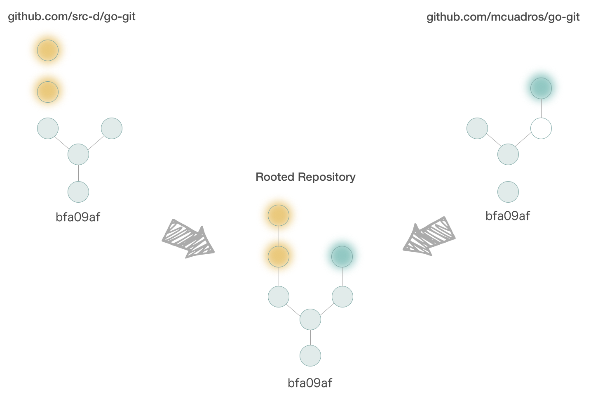

# Public Git Archive

On this dataset you can find all the repositories from GitHub with more than 50 stars.

## Downloading the dataset

To see the full list of repositories in the dataset or download it, you will need to install
[pga](pga).
Simply install Go and then run `go get github.com/src-d/datasets/PublicGitArchive/pga`.

Then to list all of the repositories in the dataset, simply run:

```bash
pga list
```

If you'd rather get a detailed dump of the dataset (not including the file contents)
you can choose either `pga list -f json` or `pga list -f csv`.

To download the full dataset, execute:

```bash
pga get
```

Or if you want to download only those repositories containing at least a line of Java code:

```bash
pga get -l java
```

The `pga` command has `-j/--workers` argument which specifies the number of downloading threads to run, it defaults to 10.

For more information, check the [pga documentation](pga), or simply run `pga -h`.

## Links

- ### [CSV file](LINK TO CSV FILE HERE)
- ### [Siva files](LINK TO SIVA FILES HERE)

## Files explanation

Description of the content of each file type and explanation about some key concepts.

You can download and filter by csv data using [multitool](https://github.com/src-d/datasets/tree/master/PublicGitArchive/multitool).


### CSV with metadata per repository
A CSV with useful data per each repository on the dataset. The columns on the CSV are:

|  Column name | Column description  |
|---|---|
|URL|The url of the GitHub repository that allow us to access to the Github web interface.|
|SIVA_FILENAMES|List of siva filenames that contains one or more branches from that specific repository.|
|FILE_COUNT|Number of files on Commit pointed by default HEAD.|
|LANGS|List of languages contained on that repository on default HEAD.|
|LANGS_BYTE_COUNT|List of bytes count per each language contained on that repository on default HEAD. The order should be the same that LANGS column.|
|LANGS_LINES_COUNT|List of lines per each language contained on that repository on default HEAD. Ordered as previous languages counters.|
|LANGS_FILES_COUNT|List of number of files written in each language contained on that repository on default HEAD. Ordered as previous languages counters.|
|COMMITS_HEAD_COUNT|Number of commits on the history obtained by the commit pointed by default HEAD. The output is the same as `git rev-list --count HEAD`.|
|COMMITS_COUNT|Count with all the unique commits on all the siva files that contains this repository.|
|BRANCHES_COUNT|Number of references on that repository, excluding tags.|
|FORK_COUNT|Number of remotes on all the siva files on the subset that contains that repository.|
|EMPTY_LINES_COUNT|Number of empty lines on files on commit pointed by default HEAD.|
|CODE_LINES_COUNT|Number of lines with code on files on commit pointed by default HEAD.|
|COMMENT_LINES_COUNT|Number of commented lines on files on commit pointed by default HEAD|
|LICENSE|License of the repository|

### SIVA files with rooted repositories

Siva files contains **rooted repositories** with all the git objects from the standard repositories. A **rooted repository is** a standard Git repository that stores all objects from all repositories that share common history, identified by same initial commit:



Using rooted repositories we avoid data duplication as much as possible.

To read siva files, you can use: 

- [Go library implementation](https://github.com/src-d/go-siva)
- [Java reader implementation](https://github.com/src-d/siva-java)
- [Engine. Spark Datasource to read repositories](https://github.com/src-d/engine)